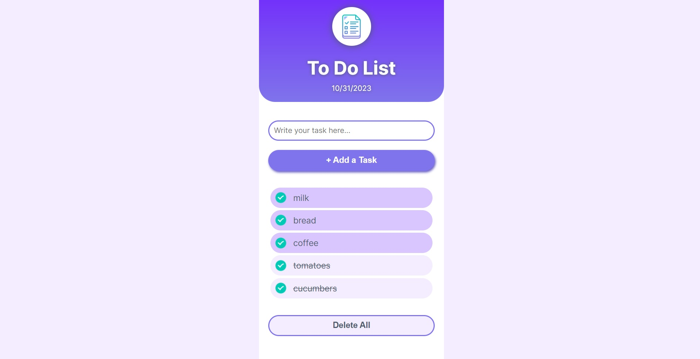

# To Do List

This is a fully-responsive [React](https://reactjs.org/) app where you can **add and delete your daily tasts**. 

<a href="https://to-do-list-for-everyone.netlify.app/"><strong>➥ Live Demo</strong></a> 

## Description

To manage your time as well as to plan your day you cannot do without a to-do-list app.
It is very ease to use and is of a great help. You can add as many things to do as you need. 
As soon as your task is finished you can click and cross it out.
Delete all tasks for today with a "Delet All" button.

The application also shows **today's date** for convenience.

***The purpose of this project*** was to train my skills in building React apps, particularly to work with Class Components.

### Built with

- Semantic HTML5 markup
- CSS custom properties
- Flexbox
- [React](https://reactjs.org/)

### Screenshots

## How to use

- Enter your task in the input form.
- Press "+ Add a Task" button or Enter tab.
- The task will appear in the to-do-list.
- Click on the task 1 time if you completed it.
- To delete all tasks use "Delete All" button.

## License

This project is **free to use** and does not contain any license.
